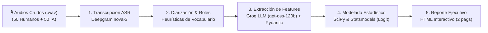

# Creceré AI — Technical Challenge: Human vs. AI Voice Agents Analysis

Este repositorio contiene la solución completa a la prueba técnica para el rol de **Data Scientist / Data Analyst Junior** en Creceré AI. El proyecto evalúa cuantitativa y econométricamente una muestra de **100 llamadas de cobranza (50 humanas y 50 de IA)** para determinar si existen diferencias estadísticamente sustentables en su desempeño y aislar los determinantes causales de la promesa de pago (PTP).

---

## 1. Preguntas, Hipótesis y Decisiones Analíticas

### ¿Qué queremos entender?
1. **¿Los deudores entienden a los agentes de IA tanto como a los humanos?** (Evaluación de claridad fonética, prosodia y peticiones de repetición).
2. **¿Los agentes de IA son inflexibles a la hora de negociar?** (Análisis de la dispersión de alternativas de pago ofrecidas y capacidad de adaptación ante objeciones).
3. **¿Qué diferencias metodológicas afectan el compromiso de pago?** (Aislamiento de factores causales de PTP mediante modelado econométrico multivariado).

### Hipótesis Declaradas y Contrastadas
* **$H_1$ (Alternativas de Pago):** Los humanos ofrecen una mayor variedad y cantidad de alternativas de pago que la IA.
* **$H_2$ (Claridad del Mensaje):** La IA genera menor necesidad de aclaración/repetición en los clientes debido a su dicción sintética y estandarizada.
* **$H_3$ (Resolución de Objeciones):** Los humanos tienen una tasa de resolución de objeciones significativamente mayor que la IA.
* **$H_4$ (Variabilidad Tonal):** Los humanos presentan mayor diversidad tonal (empatía y modulación) medida por entropía de Shannon $H(X)$.
* **$H_5$ (Monopolización de la Llamada):** La IA monopoliza la conversación con un mayor ratio de tiempo de habla que los humanos ($>75\%$).

### Decisiones Metodológicas Clave
* **Corte por Contacto Efectivo (RPC):** La contactabilidad bruta tiene un sesgo de discado previo ($p = 0.0134$). Para evitar sesgo de selección en la evaluación de la habilidad conversacional, el análisis de negociación y modelado causal se evalúa sobre las **$n = 61$ llamadas con contacto efectivo verificado** ($n_{\text{humano}} = 37$, $n_{\text{ia}} = 24$).
* **Modelado Econométrico Multivariado:** Se formula una regresión logística controlando simultáneamente por condición de IA, oferta de alternativas, claridad, monopolización y objeciones, aislando el efecto propio de cada factor.

---

## 2. Construcción de Datos y Justificación de Variables

El dataset analítico (`data/processed/analytical_dataset.parquet` y `.csv`) integra variables en dos dimensiones principales:

### A. Variables Acústico-Temporales (Deepgram nova-3)
* `duration_seconds`: Duración total del audio en segundos.
* `talk_ratio_agente`: Proporción del tiempo de habla correspondiente al agente respecto a la llamada.
* `agent_words` / `customer_words`: Conteo de palabras emitidas por cada rol mediante diarización.
* `num_utterances`: Cantidad de turnos conversacionales alternados.
* `mean_confidence`: Confianza acústica promedio del ASR.

### B. Variables Semánticas Estructuradas (Groq LLM + Validación Pydantic)
* `is_rpc` (Right Party Contact): Contacto efectivo validado con el titular deudor.
* `ptp_logrado` (Promise to Pay): Compromiso formal de pago con fecha, monto o canal acordado.
* `num_objeciones`: Conteo de razones de no pago expresadas por el cliente.
* `num_objeciones_resueltas`: Objeciones que el agente logró rebatir o negociar favorablemente.
* `tasa_resolucion_objeciones`: Proporción calculada como `num_objeciones_resueltas / num_objeciones`.
* `alternativas_ofrecidas`: Conteo de opciones de alivio brindadas (cuotas, descuentos de mora, prórrogas).
* `tono_predominante_agente`: Clasificación categórica (`empatico_profesional`, `neutro_formal`, `rigido_robotico`, `confrontativo`).
* `peticiones_aclaracion_cliente`: Frecuencia de repeticiones pedidas por el deudor.
* `claridad_mensaje`: Métrica normalizada calculada como `1 / (1 + peticiones_aclaracion_cliente)`.

### Justificación de la Elección de Variables
La selección de estas variables responde a observaciones empíricas iniciales tras la escucha exploratoria de llamadas:
1. **`talk_ratio_agente`:** Se buscaba medir la proporción de habla para determinar empíricamente si los agentes (humanos o IA) monopolizaban la conversación o si existía un diálogo bidireccional balanceado.
2. **`tono_predominante_agente`:** Se buscaba clasificar y cuantificar la entropía tonal para verificar si los agentes humanos contaban con mayor modulación, calidez y adaptabilidad empática frente a la neutralidad estandarizada de la IA.
3. **`num_objeciones_resueltas`:** Al analizar los audios preliminares, se detectó con frecuencia que **la IA ignoraba las dudas, calamidades o inquietudes reales de los deudores**, continuando con el guion prefijado sin gestionar la resistencia. Esta variable cuantifica dicha fricción.
4. **`peticiones_aclaracion_cliente` / `claridad_mensaje`:** Se buscaba registrar cuántas veces el cliente solicitaba aclaración ("¿cómo?", "¿qué dijo?", "¿me repite?") para evaluar si existían deficiencias de cadencia, velocidad o prosodia sintética que afectaran la comprensión del acuerdo.

---

## 3. Pipeline Integral de Procesamiento

El flujo de procesamiento de extremo a extremo transforma la señal acústica cruda en insights ejecutivos reproducibles:



### Tecnologías Utilizadas por Etapa
* **Transcripción y Diarización:** `httpx`, Deepgram API (`model: nova-3`, `language: es`, `diarize: true`, `smart_format: true`).
* **Identificación de Roles y Heurísticas:** Lógica determinística en `src/diarization_parser.py`.
* **Extracción Semántica Estructurada:** Groq Cloud API (`openai/gpt-oss-120b`), validación estricta de esquemas con `pydantic v2`, reintentos exponenciales y chunking contextual por turnos para transcripts extensos.
* **Almacenamiento y Manipulación de Datos:** `pandas`, `pyarrow` (Parquet columnar), `duckdb`.
* **Modelado Estadístico y Econométrico:** `scipy.stats` (Mann-Whitney $U$, Welch's $t$, Fisher, $\chi^2$, Shapiro-Wilk) y `statsmodels` (Regresión Logística multivariada).
* **Generación de Reporte:** Python standalone generator (`src/generate_report.py`) que compila un HTML con diseño corporativo responsivo e imprimible en A4.

### Identificación de Roles y Heurísticas de Clasificación
Debido a que la diarización acústica pura asigna etiquetas numéricas genéricas (`speaker 0`, `speaker 1`), fue necesario implementar heurísticas basadas en procesamiento de texto y vocabulario especializado en cobranza bancaria:
* **Detección de Buzones / IVR:** Búsqueda de patrones como *"deje su mensaje después del tono"*, *"casilla de voz"*, *"marque 1"*, clasificándolos de forma temprana como `Otro`.
* **Identificación del Agente:** Ponderación léxica de frases institucionales de apertura y cobro (*"me comunico de"*, *"área de normalización"*, *"acuerdos de pago"*, *"obligación pendiente"*) e iniciativa en los turnos iniciales.
* **Identificación del Cliente:** Detección de respuestas características de titularidad (*"con ella/él"*, *"de parte de quién"*, *"no cuento con dinero"*, *"calamidad doméstica"*).
* **Desdoblamiento Mono-Speaker:** En llamadas humanas donde el canal unificaba a ambos hablantes bajo una sola etiqueta por solapamiento acústico, el parser desdobla los turnos reconociendo alternancias de interrogación y respuesta.

> **Oportunidad de Mejora:** Si bien estas heurísticas resolvieron el 100% de la muestra, este proceso podría fortalecerse implementando un **método de verificación manual o muestreo de control humano más robusto (Human-in-the-loop / Active Learning)** que audite periódicamente los casos con menor confianza fonética o solapamientos complejos.

---

## 4. Comparación Humanos vs. IA: Resultados Estadísticos

### Embudo Operativo Global ($n = 100$)
| Etapa del Embudo | Humanos ($n=50$) | IA ($n=50$) | Brecha | Test Estadístico / Significancia |
| :--- | :---: | :---: | :---: | :--- |
| **Contacto Efectivo (RPC)** | **74.0%** (37) | **48.0%** (24) | +26.0 p.p. | $\chi^2 = 6.05$, Fisher $p = 0.0134$* ($\text{Odds Ratio} = 3.08$) |
| **Negociación Iniciada \| RPC** | 100.0% (37/37) | 100.0% (24/24) | 0.0 p.p. | No hay rechazo al iniciar el diálogo |
| **Oferta de Alternativas \| RPC** | 73.0% (27/37) | 100.0% (24/24) | -27.0 p.p. | IA ofrece siempre cuotas fijas (IQR = 0.0 vs. 3.0) |
| **Compromiso de Pago \| RPC** | **62.2%** (23) | **50.0%** (12) | +12.2 p.p. | Fisher $p = 0.457$ (No significativo sin control) |

### Matriz de Validación de Hipótesis ($n_{\text{RPC}} = 61$)
| Hipótesis | Variable | Humanos ($n=37$) | IA ($n=24$) | Contraste | Valor $p$ | Tamaño del Efecto | Veredicto |
| :--- | :--- | :---: | :---: | :--- | :---: | :--- | :---: |
| **$H_1$: Alternativas** | `alternativas_ofrecidas` | Mediana: 2.0 (IQR 3.0) | Mediana: 2.0 (IQR 0.0) | Mann-Whitney $U = 387.0$ | 0.8125 | Cliff's $\delta = -0.128$ (Despreciable) | **No confirmada** |
| **$H_2$: Claridad** | `claridad_mensaje` | 0 rep: 56.8% | 0 rep: 33.3% | Fisher exacto | 0.9806 | Cliff's $\delta = -0.181$ (Pequeño) | **No confirmada** |
| **$H_3$: Objeciones** | `tasa_resolucion` | **67.3%** | **41.2%** | Mann-Whitney $U = 316.5$ | **0.0393\*** | Cliff's $\delta = +0.281$ (Pequeño) | **CONFIRMADA** |
| **$H_4$: Tono** | `tono_predominante` | $H(X) = 1.25$ bits | $H(X) = 1.20$ bits | $\chi^2 = 0.40$ ($df=2$) | 0.8187 | $\Delta H = +0.05$ bits | **No confirmada** |
| **$H_5$: Monopolización**| `talk_ratio_agente` | Media: 49.5% | Media: 46.2% | Welch's $t = -1.06$ | 0.8520 | Hedges' $g = -0.279$ (Pequeño) | **No confirmada** |

### Modelo Econométrico Multivariado: Determinantes de la Promesa de Pago
$$\text{logit}(P(\text{PTP}=1)) = \beta_0 + \beta_1 \cdot \text{is\_ia} + \beta_2 \cdot \text{alternativas} + \beta_3 \cdot \text{claridad} + \beta_4 \cdot \text{talk\_ratio} + \beta_5 \cdot \text{num\_objeciones}$$

* **Efecto Alternativas ($\beta_2 = +0.7338$):** **$\text{Odds Ratio} = 2.083$** ($p = 0.0422$*, IC 95%: $[1.026, 4.229]$). Cada alternativa ofrecida **duplica las probabilidades relativas de pago**.
* **Efecto Resistencia ($\beta_5 = -0.4227$):** **$\text{Odds Ratio} = 0.655$** ($p = 0.0293$*). Cada objeción reduce las odds de acuerdo en un $34.5\%$.
* **Efecto Propio de la IA ($\beta_1 = -0.8807$):** **No significativo** ($p = 0.1453$, IC 95%: $[0.127, 1.356]$). Controlando por alternativas y objeciones, la IA no es estadísticamente inferior al humano.

---

## 5. Hallazgos Clave Accionables

1. **La IA duplica sus acuerdos por cada alternativa financiera que ofrece:** Cada opción de alivio adicional multiplica las probabilidades de compromiso por **$2.08\times$ ($\text{OR} = 2.08$, $p = 0.042$)**.
2. **Los deudores no rechazan a la IA por ser máquina:** En el $100\%$ de los contactos efectivos la IA entabló negociación formal; en el modelo multivariado el factor IA carece de significancia estadística adversa ($p = 0.145$).
3. **Pérdida crítica de contactabilidad en el discado ($52.0\%$):** La IA solo contacta al $48.0\%$ de deudores frente al $74.0\%$ humano, desgastando esfuerzos en contestadoras e IVRs por ausencia de detección de contestadoras (AMD).
4. **Rigidez de negociación en el Voicebot:** La IA actual presenta un rango intercuartílico $\text{IQR} = 0.0$ (ofrece exactamente 2 cuotas fijas), mientras los humanos adaptan de 0 a 5 alternativas ($\text{IQR} = 3.0$) resolviendo el $67.3\%$ de objeciones vs. $41.2\%$ de la IA ($p = 0.039$).
5. **Reparto conversacional equilibrado:** El bot habla el $46.2\%$ del tiempo frente al $49.5\%$ de los humanos, descartando monopolización indebida de la llamada.

---

## 6. Estructura del Repositorio y Reproducibilidad

El repositorio incluye archivos `.gitkeep` para preservar la estructura de carpetas necesaria para la ejecución completa:

```text
├── audios/
│   ├── audios_humanos_censurados/  # (.gitkeep) Destino de los 50 audios humanos (.wav)
│   └── audios_ia_censurados/       # (.gitkeep) Destino de los 50 audios de IA (.wav)
├── data/
│   ├── raw_transcripts/            # (.gitkeep) Capa 1: Caché cruda JSON de Deepgram nova-3
│   ├── transcripts/                # (.gitkeep) Capa 2: Transcripciones formateadas en Markdown
│   ├── raw_features/               # (.gitkeep) Capa 3: Features semánticas extraídas en JSON
│   └── processed/                  # (.gitkeep) Capa 4: analytical_dataset (.parquet/.csv) y resultados
├── src/
│   ├── transcriber.py              # Ingesta y transcripción ASR con Deepgram
│   ├── diarization_parser.py       # Parseo de turnos y clasificación heurística de roles
│   ├── feature_extractor.py        # Extractor semántico estructurado con LLM (Groq) y Pydantic
│   ├── statistical_analysis.py     # Tests de hipótesis y modelo econométrico logit
│   └── generate_report.py          # Generador autónomo del reporte ejecutivo en HTML
├── reporte_ejecutivo.html          # Reporte final generado (2 páginas, formato A4)
├── requirements.txt                # Dependencias del proyecto
└── README.md                       # Documentación metodológica completa
```

### Requisitos Previos para Reproducir el Pipeline
Para ejecutar el pipeline desde cero se requiere:
1. **Archivos de audio:** Ubicar los audios `.wav` provistos en `audios/audios_humanos_censurados/` y `audios/audios_ia_censurados/`.
2. **Credenciales de API:**
   * `DEEPGRAM_API_KEY`: Clave de acceso a Deepgram (modelo nova-3 en español).
   * `GROQ_API_KEY`: Clave de acceso a Groq Cloud (modelo `openai/gpt-oss-120b`).
   Configurarlas en un archivo `.env` en la raíz del proyecto basándose en `.env.example`:
   ```bash
   DEEPGRAM_API_KEY=tu_api_key_de_deepgram
   GROQ_API_KEY=tu_api_key_de_groq
   ```

### Pasos de Ejecución

1. **Instalar dependencias:**
   ```bash
   pip install -r requirements.txt
   ```
2. **Ejecutar el pipeline secuencialmente:**
   ```bash
   # 1. Transcribir audios y generar diálogos con roles
   python src/transcriber.py

   # 2. Extraer variables semánticas estructuradas con LLM
   python src/feature_extractor.py

   # 3. Ejecutar análisis estadístico y modelo econométrico
   python src/statistical_analysis.py

   # 4. Compilar el reporte ejecutivo final en HTML (2 páginas)
   python src/generate_report.py --output reporte_ejecutivo.html
   ```

---

## 7. Entregables Oficiales

* **Entregable 1 — Reporte Ejecutivo en HTML:** [`reporte_ejecutivo.html`](file:///home/josorioam/programming/crecere_tech_proof/reporte_ejecutivo.html) (2 páginas estrictas, visual, diseñado para alta gerencia y comité de riesgos/operaciones bancarias).
* **Entregable 2 — Repositorio Público de GitHub:** Código limpio, auditable y reproducible, con versionamiento por capas y exclusión estricta de credenciales y datos sensibles.
